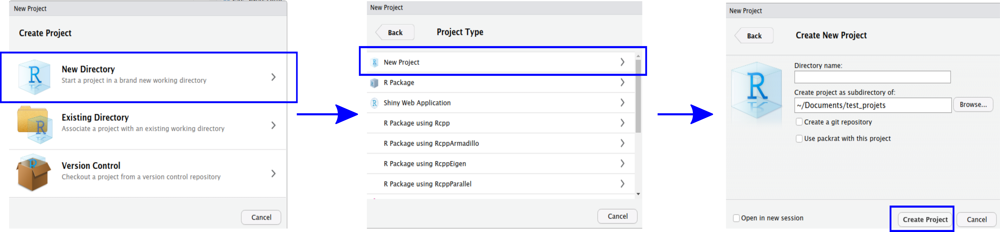
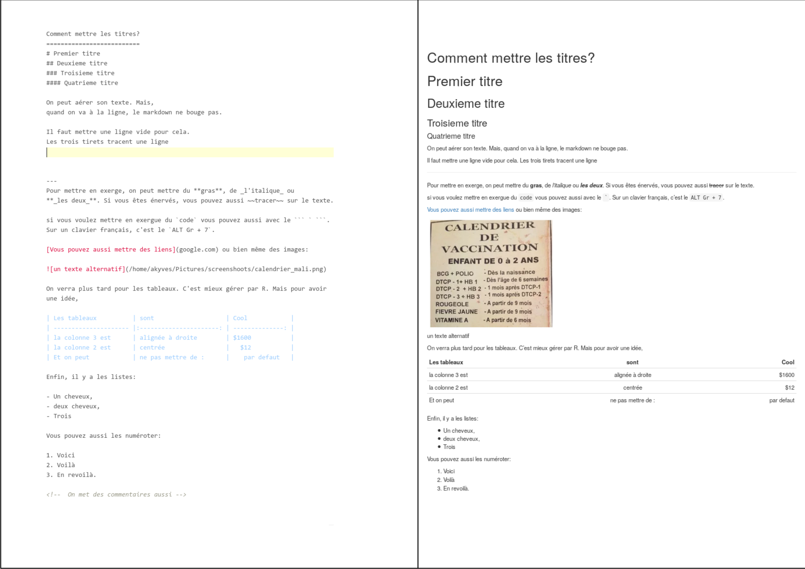
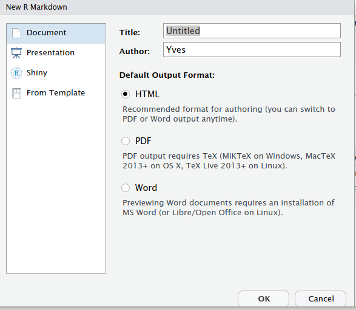
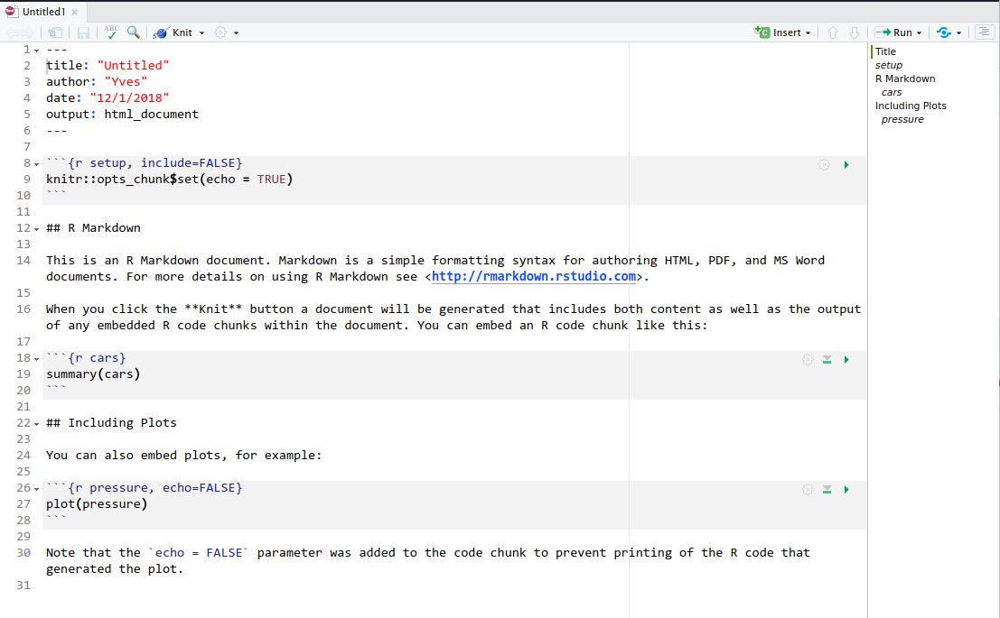
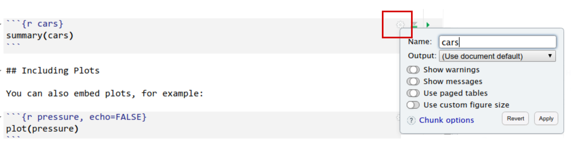

## Préliminaires avant la première séance. {#prem-seance}

```{r setup, include=FALSE}
knitr::opts_chunk$set(
  echo = TRUE,
  message = FALSE,
  warning = FALSE,
  R.options = list(width = 80))
```

```{block, type = "montype2"}

L'objectif de ce petit tutoriel est de guider dans l'installation de R et 
Rstudio sous Windows et de s'assurer que vous avez une distribution prête pour 
la suite des travaux que nous allons effectuer.

```

### Installer R sur Windows

#### Première installation

Pour une première installation, vous aurez besoin de:

- La dernière version de R, 
[disponible ici](https://cran.r-project.org/bin/windows/base/)
- Pour nous orienter vers le futur, nous allons travailler avec la version
preview de Rstudio, 
[disponible ici](https://www.rstudio.com/products/rstudio/download/preview/).

Suivez ensuite les étapes suivantes:

(_lorsque je mets **_[numerodeversion]_** je veux parler du numero de la version 
récente que vous trouverez: En général, il s'agit d'une succession de 
chiffres séparés par des points. Ex: 1.2, 3.5.1, etc._)

- Installez R en lançant le fichier _R-[numerodeversion].exe_. 
Gardez les options par défaut ( _suivant --> suivant -->_ )
- Installez Rstudio en lançant le 
fichier _RStudio-[numerodeversion].exe_. Gardez aussi les options par
défaut.

#### Une installation propre

Le logiciel R vient avec le minimum pour faire les analyses statistiques. 
Mais vous aurez besoin d'installer au cours de l'apprentissage un ensemble de 
petites portions de logiciels qui vont venir compléter R pour faciliter 
certains traitements et analyses de données. Ces portions sont appelées package. 
Maintenant nous allons créer un dossier qui va contenir l'installation
pour les futurs packages, sans que vous ayez à vous déranger  lors de 
l'installation d'une nouvelle version de R.


- Créez dans le dossier `Document` un dossier qui va contenir 
vos packages (`RPackage` par exemple)
- Accédez aux paramètres avancés de l'ordinateur
- Choisissez l'option de création de variables d'environnement
- Créez une variable d'environnement nommée `R_LIBS_USER` qui va pointer vers
le dossier que vous avez créé pour contenir les packages.

#### Update

Pour faire un update sous Windows, créez le dossier qui va contenir 
vos package au niveau de la section précédente, et 
installez comme une nouvelle fois R.
Si vous avez perdu des package sur le coup, on en 
discute à la séance de formation.

### Installer R sous Ubuntu/Debian

R se trouve déjà dans les dépôts officiels sous linux à dérivé Debian. Mais
vous n'aurez pas sûrement la toute dernière version de R, ceci dû à un décalage
entre l'ajout de la dernière version et sa sortie. Il est préférable de garder
ces options par défaut, mais vous pouvez ajouter le dépôt de la dernière version
si cela vous chante. C'est la première ligne de la commande. 

#### Première installation

```{bash eval=FALSE, include=TRUE}

sudo add-apt-repository "deb http://cran.rstudio.com/bin/linux/ubuntu $(lsb_release -sc)/"

sudo apt install r-base r-base-core

```

#### Update

Au cas ou vous avez déjà installé R vous pouvez juste faire 
un upgrade (sous ubuntu 18.04 le update est fait automatiquement 
avant un upgrade. Sous les versions inférieures, faites
d'abord un update).

```{bash eval=FALSE, include=TRUE}
sudo add-apt-repository "deb http://cran.rstudio.com/bin/linux/ubuntu $(lsb_release -sc)/"

sudo apt upgrade

```


### Pour la première séance

Si vous n'avez pas de distribution complète sur votre machine, vous allez
devoir installer une distribution minimale à des fins de démonstration.

Vous aurez ainsi besoin d'installer les  packages suivants sous R: 
`tidyverse` et `tinytex`.

```{r eval=FALSE}
install.packages("tidyverse")
install.packages("tinytex")

tinytex::install_tinytex()

```

Si vous avez déjà une distribution complète de LaTeX sur votre ordinateur,
plus besoin d'installer le package `tinytex` sur votre machine.


### Description de la base de données 

```{block, type = "montype2"}

*Ce cas pratique provient de données utilisées en évaluation d'impact a l’école,*
*un de nos anciens TPs.*


Dans ce cas pratique, nous allons analyser des données provenant 
d’une évaluation d’impact à assignation aléatoire (randomisée). 
L’objectif est de vérifier si une baisse de coûts liés à l’obtention 
des résultats du VIH Sida, amène une hausse du nombre de personnes qui cherchent
à obtenir leur résultat. Pour cela, on effectue de façon aléatoire des 
expériences sur des individus qui se présentent pour effectuer le test 
du VIH Sida. En évaluation d’impact, on parle d’Essais Randomisés
(Random Control Trial). Les sujets au test du VIH sont encouragés ou non 
dans leur volonté d’obtenir leur résultat. On annonce ainsi à un individu 
choisi de façon aléatoire, qui vient effectuer son test qu’il recevra un montant
s’il vient chercher le résultat de son test de VIH.
Cette annonce n’est pas faite à toutes les personnes ; elle est faite à un 
certain nombre, choisi aléatoirement. Le montant que l’on annonce à un sujet 
diffère de celui annoncé à un autre. Les montants varient donc en fonction des 
différents individus. Cette variation est, elle aussi aléatoire. 
Les informations concernant les individus de l’expérience sont dans la base 
du cas pratique.

Un coup d’œil sur la base de données 
(les 5 premières variables et les 6 premières observations):


```


```{r echo=FALSE}
load("data/cas_pratique.RData")
head(cas_pratique)[,1:5]

```

Vous pouvez déjà deviner à quoi correspond certaines variables.
Notre question est la suivante: En jetant un coup d’œil sur les données,
faut-il encourager les personnes à chercher leur résultat?

## Récapitulatif de la séance une. {#recap-une}

```{block, type = "montype2"}

**Pour ceux qui n’étaient pas là , vous avez raté quoi...**

Pas grand chose. Après une brève présentation sur moi et sur R, 
nous avons travaillé à partir d'un dossier nommé `seance1` dont la structure est
affichée ici, juste en bas du paragraphe. Il contient les instructions de début 
pour l'installation de R ainsi qu'une définition de la base de données utilisée
dans le travail, qui existe sous différents formats dans le dossier `data`.  
On a appris à charger une base sous R, sous format `.txt`, et au passage
on a appris quelques raccourcis claviers.

```

**Structure du dossier partagé**

          seance1
            +
            ++++++++ data/
            +         +
            +         ++++++++++ cas_pratique.dta
            +         ++++++++++ cas_pratique.RData
            +         ++++++++++ cas_pratique.sav
            +         ++++++++++ cas_pratique.txt
            +         ++++++++++ cas_pratique.xlsx
            +         
            +
            ++++++++ seance1.R
            +
            ++++++++ 1-installation.html

Pour ceux qui veulent installer R et Rstudio, suivez les instructions dans la 
[première section](#prem-seance)
    
### Bref Historique

[R](https://www.r-project.org/) [c'est quoi?](https://www.r-project.org/) 
Sans rentrer dans les racines de la naissance de R, que je  vous invite à [regarder](https://cran.r-project.org/doc/html/interface98-paper/paper.html) 
une fois que vous deviendrez fanatique, je vais y aller de façon brève:

- Au début, il y avait un logiciel statistique 
(beaucoup plus un programme statistique), appelé **S**, créé par 
[John Chambers](https://en.wikipedia.org/wiki/John_Chambers_(statistician)). 
**S** a connu d'énormes évolutions, depuis lors et est un logiciel propriétaire.
- C'est le mot *propriétaire* qui déclenche les réflexions. Un logiciel 
propriétaire ne donne pas la permission de le modifier librement, ce qui agace 
souvent le monde scientifique.
- L'idée est donc venue à des professeurs néo-zélandais 
([Ross Ihaka](https://en.wikipedia.org/wiki/Ross_Ihaka) et 
[Robert Gentleman](https://en.wikipedia.org/wiki/Robert_Gentleman_(statistician)), 
vous voyez d'où vient R....), de lancer un langage, basé sur le **S** mais qui 
devait non seulement apprendre des défauts du précédent langage, mais aussi 
s'ouvrir à la communauté scientifique, permettre que chacun y mette son grain
de sel.
- *R1.0.0* est donc né officiellement le 29 Février 2000. 
L'avantage était sa gratuité, mais aussi sa disponibilité pour presque 
tous les OS (Mac, Windows, Linux). Immédiatement, plein d'anciens acteurs 
de **S**, s'y sont intéressés. 
Ils ont apporté une évolution constante, et le monde entier a contribué à 
améliorer le logiciel et le langage, puisqu'il était accessible à tous.

- Aujourd'hui, R est une immense bulle dans le monde du développement 
statistique, et a des tentacules incroyables.... 
On en reviendra tout au long de la série.

R est donc un langage de programmation pour étudier et travailler des données,
gratuit, disposant d'une communauté incroyable et très active. 
Il existe une tonne de ressources en ligne pour s'entraîner et le maîtriser, 
qui expliquent les détails les plus minutieux du logiciel.

Je fais ici une petite présentation de Rstudio. Rstudio, est un environnement
de développement intégré pour R, dont la premère sortie date du 28 Février 2011.
L'environnement a été créé par [**JJ Allaire**](https://github.com/jjallaire) 
qui a fondé une société du même nom. Rstudio est juste un environnement pour 
faciliter l'utilisation de R. Il est bien possible d'effectuer ses analyses
statistiques sous R sans Rstudio, mais ce dernier offre une convivialité de
travail qui permet de gagner en temps et d'eviter de nombreuses frustrations.

Son actuel (2019) Chief Scientist est [Hadley Wickham](http://hadley.nz/) 
et pleins d'ingénieurs et de développeurs de Rstudio ont contribué énormément à
l'avancée de R à travers les packages qu'ils ont créé et mis à la disposition
de tout un chacun. 

### Les commandes qu'on a tapées

- On a ouvert le fichier `seance1.R` en double-cliquant dessus. 
Il était vide, mais s'est ouvert sous `Rstudio`. 
On a profité pour apprendre et connaître un peu l'environnement de `Rstudio`,
ainsi que les différentes fenêtres. On a aussi appris comment définir un 
**répertoire de travail** grâce aux commandes `getwd()` et `setwd()`. 
On a appelé le fichier `seance1.R` **un fichier script**, où on 
tape les commandes qui vont s’exécuter après dans la console.

- On a ensuite importé une base de données au format `.txt` en utilisant une 
**fonction**. On a dit que les commandes sous R se basent sur des fonctions, 
dont on peut accéder à **l'aide** en faisant `?nom_de_la_fonction`. 
On a remarqué que concernant la fonction `read.table` pour charger
les fichiers `.txt`, on a plusieurs **options** ou **arguments**... 
On a ensuite chargé la base de données dans un objet appelé `cas_pratique` 
qui est un `data.frame`; un **objet liste** de R. On a vu aussi que les
**commentaires dans** un fichier script sont précédés de #.

```{r}

#ceci est un commentaire.

cas_pratique <- read.table("data/cas_pratique.txt", header = TRUE)
```

- On a vu qu'on peut observer les variables de la base et y accéder avec `$` en 
utilisant une commande nommée `str`.

```{r}
str(cas_pratique)
```

On a ensuite vue que les variables sont en fait des vecteurs, 
qui ont des caractéristiques différentes et particulières. Les facteurs 
par exemple sont une sorte de représentation étiquetée des
variables catégorielles.

Voilà, le rattrapage est terminé, sauf pour les raccourcis suivants sous RStudio:

```{block, type = "montype2"}

- CTRL+ENTRE pour exécuter du code
- ALT+- pour insérer le `<-`
- CTRL+SHIFT+C pour commenter une portion de texte dans un script.

```

### Pour la prochaine séance

Installez juste les packages du `tidyverse` et une version minimale de latex pour
faire tourner la démo que nous ferons si vous n'avez pas latex sur votre machine.

```{r eval=FALSE}
install.packages("tidyverse")
install.packages("tinytex")

tinytex::install_tinytex()

```


## Récapitulatif de la séance deux. {#recap-deux}

```{block, type = "montype2"}

**Pour ceux qui n’étaient pas là , vous avez raté quoi...**

La partie statistiques descriptives. Après avoir effectué un petit rappel 
de la séance 1, on a continué l'exploration de nos données en faisant un détour 
sur les données manquantes. Malheureusement, certains n'avaient les *packages* 
nécessaires pour charger les bases sous d'autres formats. Nous allons y venir 
dans la section *ce qui restait*, que je vous invite vivement à  suivre pas à pas.
On a appris que dans R, les objets ont des *modes* c'est à dire le *type* 
de données qui les constitue. Ils peuvent être soit des caractères, soit des 
numériques, soit des entiers, soit des logiques (`TRUE` ou `FALSE`) ou même des 
complexes. On a vu aussi que sous R, vous avez exactement deux principales 
manières de stocker des données.

- Un stockage avec des *modes* uniques: Vecteurs, Matrices, Tableaux.
- Un stockage avec des *modes* variés: `data.frame`[^1], liste.

Finalement, on a dit que R lorsqu’il le peut effectue, sur des stockages de mode
unique, une conversion automatique vers le mode le plus fort lorsque cela est
nécessaire.

On a appris à créer une fonction sous R, un vecteur, une table, un barplot, et au 
passage on a répondu à des questions sur notre base de données.

Malheureusement, on n'a pas eu le temps de parcourir tout ce qui avait été prévu.
Je vous invite à lire la section *Ce qui restait* pour combler le gap.

```

### Ce qu'on a fait

Dans cette section on va présenter un bref aperçu de ce qu'on a fait le jour
de la séance, pour permettre de se rappeler. Pour ceux qui veulent en savoir plus
que ce qui a été fait dans les deux petites heures, vous pouvez passer à la section
suivante.

#### Rechargement du `data.frame`

 On a rechargé une nouvelle fois le *data.frame* de travail. C'est le *data.frame* 
`cas_pratique.txt`. Mais avant, il ne faut pas oublier de redéfinir le répertoire
de travail de R à l'endroit où se trouve le fichier script. Rassurez-vous aussi d'avoir
aussi le dossier *data* avec les bases de données sous différents formats. Pour définir
le répertoire de travail au répertoire courant, une fois que vous
**aurez ouvert** le fichier script , cela se fera de la façon suivante:

- Cliquez sur `Session` dans Rstudio,
- Cliquez ensuite sur `Set Working Directory`
- Enfin choisissez `To Source File Location`.

Le chargement de la base de données s'effectue de la façon suivante:

```r
cas_pratique <- read.table(file = "data/cas_pratique.txt", header = TRUE)
```

On a observé les statistiques sommaires de la base de données avec la 
fonction `summary` et on a examiné ses variables, en utilisant la fonction `str`.

```{r}
summary(cas_pratique)

str(cas_pratique)
```

Après avoir remarqué que la base compte 9 variables et 1078 observations, 
on a vu que les variables sont des vecteurs ayant différents sortes de *type*, 
appelés *modes*. Les facteurs, appelés *factor* par exemple, sont des entiers, 
avec des étiquettes derrière chaque valeur qui sont les niveaux (*level*) 
de ce facteur; c'est en quelques sortes les modalités de la variable catégorielle.

#### Analyse des données manquantes

Les variables du *data.frame* peuvent être accessibles avec le dollar, `$`. On a
vu aussi que les variables du *data.frame* sont des vecteurs, qui contiennent donc
des valeurs de même mode. On a ensuite décidé de calculer le pourcentage
de manquants sur la variable `sexe`, en utilisant les fonctions `is.na`, `sum` 
et `length`, et en se rappelant que R effectue une conversion 
lorsque cela est nécessaire.

En effet la fonction `is.na` appliquée sur un vecteur, retourne un vecteur
de mode `logical` qui teste si chaque valeur du vecteur donnée en argument
est une valeur manquante ou pas, et retourne un `TRUE` si oui, 
et un `FALSE` sinon.

Grâce à la conversion, le `TRUE` est converti en 1 et le `FALSE` en 0. On a donc
cherché le pourcentage de manquants sur la variable sexe de la façon suivante:

```{r}
sum(is.na(cas_pratique$sexe)) / length(cas_pratique$sexe)
```


On a eu l’idée d'appliquer la même chose à toutes les variables du *data.frame*. 
Mais pour ne pas écrire toutes les variables avec le dollar `$`, on a décidé de 
faire une fonction qui va prendre un vecteur `x` en paramètre et renvoyer 
le pourcentage de manquants dans `x`. On a donc appris à créer une fonction 
que l'on a appelée `pourc_manq_calc`. On a compris qu'une fonction est un objet qui
prend en paramètre un ou plusieurs arguments. On a appris la syntax
de définition d'une fonction.

```{r}
pourc_manq_calc <- function(x){
  return(sum(is.na(x)) / length(x))
}
```

On aurait pu gagner en lignes de codes en récrivant la fonction
de la façon suivante :

```{r}
pourc_manq_calc <- function(x) sum(is.na(x)) / length(x)
```

Celà nous permet d'apprendre trois choses:

- Si la fonction ne tient que sur une seule instruction, on peut la présenter
sans les accolades sur la même ligne.

- Lorsqu'on ne met pas de `return`, la fonction retourne l'objet issu du dernier
calcul qu'il effectue.

- Pour redéfinir une fonction, il faut juste écraser l'objet ayant le nom de
la fonction par la nouvelle définition.

On a ensuite appris une nouvelle fonction, `apply`, pour exécuter une fonction 
sur toutes les colonnes (dans ce cas on met `MARGIN = 2`) ou toutes les lignes 
(dans ce cas on met `MARGIN = 1`) d'un *data.frame*. On a exécuté la fonction 
`pourc_manq_calc` sur toutes les colonnes   du *data.frame* `cas_pratique` et 
on a obtenu un vecteur de pourcentage de manquants de chaque variable. 
On a remarqué que ce vecteur avait des
noms qui correspondaient au nom de chaque variable. 
**Donc il est possible d'avoir des vecteurs dont chaque composante est nommée
sous R**.

```{r}
pourcentage_manquants <- apply(X = cas_pratique, MARGIN = 2, FUN = pourc_manq_calc)
pourcentage_manquants
```

On a ensuite effectué un graphique en barre pour avoir le pourcentage de manquants
par variables grâce à la fonction `barplot`.

```{r bar-simple, layout = "l-body-outset", fig.width=18, fig.height=12, fig.cap="Exemple de barplot"}
barplot(pourcentage_manquants)
```

On a ensuite vu que l'on pouvait changer un peu l'allure du graphique pour le rendre
plus propre et plus beau, conformément à ce que nous voulons. On a décidé d'effectuer les changements suivants:

1. Donner un vecteur plus cohérent que des noms de variables séparés par des `_` pour
les noms au niveau des axes des abscisses (on a créé pour la première fois un vecteur
de caractères dans R, nommé `noms` et on a utilisé l'argument `names.arg` de la
fonction `barplot`).

2. Changer la couleur des barres (On a utilisé l'argument `col` de la fonction `barplot`).

3. Réduire légèrement la taille au niveau des noms sur l'axe des abscisses (On a utilisé
l'argument `cex.names` de la fonction `barplot`)

4. Donner un titre aux axes des abscisses et des ordonnées  et donner un titre au graphique
(On a utilisé les arguments `xlab`, `ylab` et `main` respectivement)

5. Multiplier par 100 pour avoir les pourcentages[^2] sur le graphique en barre.

Je profite dans la démonstration d'en bas, pour vous ajouter plusieurs options pour
les graphiques en barre en plus des 5 choses que l'on a citées en haut, afin de vous
permettre de voir l’étendue des possibilités. Les codes de couleurs précédés de #
sont des codes hexa, qui viennent du site <https://www.color-hex.com>.

On a ainsi obtenu ceci:

```{r bar-plus, layout = "l-body-outset", fig.width=17, fig.height=12, fig.cap= "Barplot avec options supplementaires"}

#On cree un vecteur en utilisant le c, la parenthese et les elements
#qui le compose entre griffes si ce sont des caracteres, separe par une virgule.

noms <- c("sexe", "age", "niveau d’étude",
          "résultat du test", "incitation reçue?",
          "montant de l'incitation", "test cherche?",
          "rapports sexuels?", "rap. sexuels 12 mois?")

barplot(100*pourcentage_manquants,
        #la couleur de la barre
        col = "skyblue",
        #Le nom des elements de l'axe des variables
        names.arg = noms,
        # Le titre du graphe
        main = "REPRESENTATION DES % DE MANQUANTS",
        # faut-il ou pas mettre une bordure?
        # Si oui on peut mettre la couleur
        border = "#0038B2",
        #la fonte des axes en gras
        font.axis = 1,
        #la couleur sur les axes
        col.axis = "#0038B2",
        #la couleur sur les axes
        col.main = "#CC2828",
        #la couleur des titres des axes
        col.lab = "#CC2828",
        #La taille du titre
        cex.main = 2,
        #La taille sur les axes
        cex.axis = 2,
        # la taille des etiquettes des axes
        cex.lab = 2,
        #la position des etiquettes sur l'axe des ordonnees 
        ##(perpendiculaire a l'axe)
        las = 1, 
        #Faut-il des barres horizontales ou verticales?
        horiz = FALSE, 
        # le titre de l'axe x
        xlab = "Différentes variables",
        # Le titre de l'axe y
        ylab = "Pourcentage de manquants", 
        )

```

Pour finir , si vous voulez faire des tours sur les options des graphiques
en barre effectués avec les fonctionnalités basiques de R, [regardez ici](https://www.r-graph-gallery.com/209-the-options-of-barplot/), [là](https://www.r-graph-gallery.com/210-custom-barplot-layout/), ou encore
[là](http://www.r-graph-gallery.com/37-barplot-with-number-of-observation)

#### Quelques tabulations

Apres voir analysé les graphiques, on a effectué quelques tabulations pour 
obtenir des réponses sur certaines questions ludiques que l'on a posées.

1. Comment se repartissent les pourcentages de manquants pour la variable 
`rapports_sexuels_12m` suivant le sexe?
2. Quel est le taux de prévalence du VIH sida dans l’échantillon?

Pour répondre à la première question, on a utilisé une fonction de R, la fonction `by`.
C'est une fonction qui mimique le `tapply` et permet d'effectuer une tâche suivant
les valeurs d'un facteur. On a donc calculé le pourcentage de manquants, suivant
les valeurs de la variable `sexe` pour la variable `rapports_sexuels_12m`.

```{r}
by(cas_pratique$rapports_sexuels_12m, cas_pratique$sexe, pourc_manq_calc)
```
On remarque que près de 25% des personnes de sexe Masculin n'y ont pas
répondu, contre seule 11% chez les personnes de sexe Féminin.
On a après effectué une tabulation grâce à la fonction `table`, pour regarder
le nombre de personnes séropositives dans l’échantillon.

```{r}
table_sida <- table(cas_pratique$resultat_test)

table_sida
```

Mais la table nous donne les résultats absolus. Afin d'avoir les résultats relatifs,
on a utilisé la fonction `prop.table` 
pour avoir les proportions au niveau de la variable `resultat_test`.

```{r}
prop.table(table_sida)
```

On a conclut à une proportion d'environ 5% de séropositifs au sein de l’échantillon.
C'est là que nous nous sommes arrêtés à la séance passée. 
Mais il restait certaines petites choses que nous n'avions pas abordées. 
C'est l'objet de la section suivante.

### Ce qui restait

Il ne restait pas grand chose ;-). 
Charger les bases sous différents formats, 
faire des tabulations sur deux variables, faire une boîte à moustaches, 
et étudier l'option `na.rm`.

Comme dit précédemment, un package est juste une portion de logiciel, 
qui vient se greffer sur votre logiciel R, afin de vous permettre d'effectuer 
plus rapidement des tâches spécifiques.

Malheureusement, plusieurs personnes n'avaient pas les packages du `tidyverse`. Le [tidyverse](https://www.tidyverse.org/packages/) est un ensemble de packages qui forment
un tout cohérent pour  traiter les données, sortir des statistiques sommaires
et en faire des visualisations. Si vous ne les avez pas, veuillez les installer de la façon suivante avant de continuer avec la section:

```{r eval=FALSE}

install.packages("tidyverse")

```


Aussi, puisque nous seront amener à étudier la rédaction de rapport directement
sous RStudio, je vous conseille soit:

1. De vérifier que vous avez une installation de $\LaTeX$ complète sur votre machine,

2. Dans le cas contraire, de vous assurer que vous avez une installation minimale
requise pour effectuer presque tous les travaux, grâce au package `tinytex` que vous
devez installer. Ensuite, installer la distribution minimale.

```{r eval=FALSE}

install.packages("tinytex")
tinytex::install_tinytex()
```


#### Charger les bases d'autres formats

Pour pouvoir charger les bases de données de différents autres formats
nous allons utiliser le package `haven` qui fait partie du *tidyverse*. Il dispose
des fonctions `read_stata` (ou `read_dta`), `read_spss` (ou `read_sav`) pour
charger respectivement les bases de données aux format `stata` (`.dta`) et `spss` (`.sav`).
Nous allons les appliquer sur les bases de données sous les autres formats disponibles
dans le dossier `data`. La fonction `library`, permet de charger un package.

```{r}
library(haven)

cas_pratique_stata <- read_stata(file = "data/cas_pratique.dta")

str(cas_pratique_stata)

cas_pratique_spss <- read_sav(file = "data/cas_pratique.sav")

str(cas_pratique_spss)
```

Pour charger une base de données au format `.xlsx` (excel), 
on peut utiliser un autre package nommé `readxl` qui fait aussi
partie du tidyverse, et qui dispose de la fonction `read_excel`.

```{r}
library(readxl)

cas_pratique_excel <- read_excel( #chemin vers le fichier
                                  path = "data/cas_pratique.xlsx",
                                  #La feuille à telecharger                              
                                  sheet = 1)

str(cas_pratique_excel)
```

Vous aurez remarqué que lors des `str` que j'ai générés, les variables ne 
montrent pas exactement  les mêmes propriétés que lorsqu'on avait chargé 
la base sous format `.txt`. En effet certains facteurs (factor) 
sont pris comme caractères, et le NA est considéré comme
un caractère "NA" et non comme une donnée manquante. 
Nous reviendrons lors de la séance nettoyage de base de données sur
comment nettoyer une base et obtenir les données qui peuvent coller 
avec votre analyse.

#### Les doubles tabulations

Lorsqu'on utilisait la fonction `table` pour chercher le nombre de séropositifs, un participant avait demandé comment avoir la prévalence
par sexe. La question faisait partie des choses à voir. 
Pour avoir les proportions par sexe, on effectue une tabulation sur
deux variables: le sexe et le résultat du test de dépistage.

```{r}
table_sida_sexe <- table(cas_pratique$sexe, cas_pratique$resultat_test)

table_sida_sexe
```


Pour avoir les données en terme relatif, on utilise toujours la fonction 
`prop.table`. Mais cette fois-ci, on peut lui préciser un argument `margin` pour
indiquer si l'on veut les pourcentages par ligne (`margin` = 1) 
ou par colonne (`margin` = 2). Lorsqu'on ne le précise pas, le pourcentage
est calculé sur le total.

```{r}
prop.table(table_sida_sexe, margin = 1)
```

Chez les personnes de sexe `Feminin`, le taux de prévalence est de 7.15% dans 
l’échantillon contre 3.76% chez les personnes
de sexe `Masculin`.

#### Faire une boîte à moustaches

La fonction `boxplot` permet de faire une boîte à moustaches 
sur une variable quantitative. On peut en faire un exemple avec l'âge.

```{r, layout = "l-page", fig.width=15, fig.height=12, fig.cap = "Boxplot simple"}
boxplot(cas_pratique$age)
```

Si l'on veut visualiser la distribution suivant les valeurs d'une variable 
qualitative, on peut utiliser une notation dans R que l'on appelle notation 
formule: A gauche, on met une variable dépendante et à droite, la ou les variables explicatives suivies d'un plus. Entre la variable dépendante et les variables explicatives on
met un _tilde_ (`~`). Il faut ensuite préciser dans quelle base de données 
constituer la formule que l'on a écrite. 
C'est cette même notation qu'on peut utiliser lorsque l'on effectue des modèles.
En appliquant cette formule sur la base de données, on a:

```{r, layout = "l-page", fig.width=15, fig.height=12, fig.cap = "Boxplot multiple"}
boxplot(age ~ sexe + resultat_test, data = cas_pratique)
```

On peut donner des couleurs et éditer légèrement le graphique en:

1. Définissant le vecteur des couleurs que l'on désire mettre,

2. Donnant un titre au graphique,

3. Nommant les différents axes,

4. En donnant un vecteur qui va servir pour les noms sur les axes des abscisses,

4. En donnant une légende au graphique.

Je profite pour ajouter quelques options qui restent en général les mêmes 
pour les graphiques que vous allez rencontrer.

```{r, layout = "l-page", fig.width=15, fig.height=12, fig.cap = "Boxplot avec des options supplémentaires"}


# C'est le vecteur pour les noms des abscicces
noms_abscisses <- c("Féminin et Séronégatif", "Masculin et Séronégatif",
                    "Féminin et Séropositif", "Masculin et Séropositif"
                    )

couleurs <- c("#b8e794", "#b8e794", "#f0ddc6", "#f0ddc6")


# On cree le boxplot normalement

boxplot(age ~ sexe + resultat_test, data = cas_pratique,
        # noms pour les differents axes
        names = noms_abscisses, 
        main = "DISTRIBUTION DE L'ÂGE EN FONTION DU SEXE ET DU STATUT SÉROLOGIQUE",
        xlab = "Sexe et statut sérologique",
        ylab = "Age",
        # couleurs pour les boites
        col = couleurs,
        # la fonte des axe en gras
        font.axis = 2, 
        # la couleur sur les axes
        col.axis = "#0038B2", 
        col.main = "#CC2828",
        col.lab = "#0038B2",
        # La taille du titre
        cex.main = 2, 
        #La taille sur les axes
        cex.axis = 1.5,
        # la taille des titre des axes
        cex.lab = 1.25, 
        border = "darkblue",
        # enlever le cadre du graphique
        frame.plot = FALSE 
        )

# On revoit la couleur des axes

axis(# Sur quel axe on veut effectuer des transformations?
     side = 1, 
     #La couleur de l'axe?
     col = "#0038B2",
     # La couleur des marques sur l'axe
     col.ticks = "darkblue", 
     # Faut-il y remettre de nouvelles etiquettes?
     labels = FALSE 
     )

axis(# Sur quel axe on veut effectuer des transformations?
     side = 2,
     # La couleur de l'axe?
     col = "#0038B2",
     # La couleur des marques sur l'axe
     col.ticks = "darkblue",
     # Faut-il y remettre de nouvelles etiquettes?
     # (on peut aussi donner un vecteur d'etiquettes)
     labels = FALSE 
     )

#On met ici la legende

legend(# Ou est ce qu'on veut qu'elle soit
       x = "topright",
       # Un vecteur qui donne les valeurs a afficher
       legend = c("Séronégatifs", "Séropositifs"), 
       # les couleurs des cadres (fill)
       fill = c("#b8e794", "#f0ddc6"), 
       # la couleur du bord des petits carres
       border = "darkblue",
       # la couleur du cadre de la legende
       box.col = "darkblue",
       #Le titre de la legende
       title = "Statut sérologique",
       # la couleur du titre de la legende.
       title.col = "#CC2828",
       # la taille globale de la legende
       cex = 1.5,
       text.col = "#0038B2")
```


#### l'argument `na.rm`

Le montant investit est la somme que l'on remet à un individu lorsqu'il vient 
chercher son test. On décide de calculer la somme totale investie dans l’étude 
(Que l'individu vienne récupérer son test ou pas) grâce à la fonction `sum`. 
C'est la somme de la variable `montat_incitation`
dans la base de données.

```{r}
sum(cas_pratique$montat_incitation)
```

On sait très bien que la variable `montat_incitation` 
ne contient pas de données manquantes. Mais que serait-t-il de cette
somme si elle en contenait?
Lorsque l'on essaye de faire des calculs sur un vecteur qui contient des données 
manquantes (qui sont notées `NA`), `R` 
retourne des données manquantes en sortie. Pour cela, créons un
vecteur de avec une donnée manquante  en jumelant le vecteur `montat_incitation`
et un NA [^3] et calculons la somme de ce vecteur.

```{r}
nouveau_vecteur <- c(cas_pratique$montat_incitation, NA)

sum(nouveau_vecteur)
```

On voit bien que la somme retourne une donnée manquante `NA`. P
our éviter que la somme retourne un `NA`, on va lui ajouter l'argument 
`na.rm = TRUE` qui signifie littéralement 
*retirez les données manquantes dans le calcul de la somme*. 
Cet argument est commun à plusieurs fonctions qui travaillent sur les numériques
en particulier:

- `mean` qui calcule la moyenne d'un vecteur où il y a des valeurs numériques

- `var` qui calcule la variance de l’échantillon

- `sd` qui calcule l’écart type de l’échantillon

et bien d'autres encore.


```{r}
sum(nouveau_vecteur, na.rm = TRUE)

mean(nouveau_vecteur, na.rm = TRUE)

var(nouveau_vecteur, na.rm = TRUE)

sd(nouveau_vecteur, na.rm = TRUE)
```


### les petites questions que j'ai reçues

```{block, type = "montype2"}

**Question une**

Comment mettre des pourcentages en étiquettes au niveau de l'axe des y?

```

Reprenons le graphique en barres sur les manquants. Il serait intéressant 
d'ajouter en étiquette le pourcentage de manquants avec les pourcentages (%) sur l'axe des ordonnées. Je voulais laisser cette question pour y revenir avec le package 
`ggplot2`, mais je pense que je vais l'aborder ici sans utiliser de package, 
parce que nous allons apprendre quelques fonctions de R.

- On peut créer un vecteur en utilisant les séquences sous R. 
On demande à R de créer un vecteur partant d'une valeur initiale à une valeur 
finale, mais avec un pas.
C'est la fonction `seq`. L'argument pour préciser le pas est l'argument `by`.

```{r}
vecteur_numerique <- seq(-1, #debut
    1, #fin
    by = 0.1 #le pas
    )

vecteur_numerique
```


- On peut coller littéralement deux vecteurs sous R pour obtenir un vecteur de 
caractères formé des deux vecteurs avec la fonction `paste`. Lorsque l'on ne
donne  à la fonction `paste` qu'un seul argument à coller avec un vecteur, elle 
va le coller avec toutes les données du vecteur, un à un: on parle de **recyclage**. 
La fonction `paste` a un argument `sep` qui
permet de préciser le séparateur que l'on veut utiliser dans le processus de collage.

```{r}

vecteur_bizarre <- c("un", "deux")

paste(vecteur_bizarre, "ami(s)", sep = " bon(s)")
```

Vous-vous rappelez de la conversion automatique? Si je fais un collage entre un 
vecteur numérique et tout autre chose, je vais obtenir un caractère et le 
vecteur numérique sera converti en caractères
avant de passer au collage.

```{r}
paste(vecteur_numerique, "%", sep = " ")
```

Bien là on a déjà comment créer un vecteur  d'étiquettes. Voilà comment on va procéder.

0- Supprimer l'axe y créé par défaut dans le graphique en ajoutant l'argument `yaxt = "n"`

1- Créer une séquence qui seront les graduations de l'axe des y grâce à la fonction `seq`

2- Créer un vecteur d'étiquettes qui va être les séquences où l'on aura collé "%" grâce à `paste`

3- Appliquer cette séquence et les étiquettes associées à l'axe des ordonnées grâce à la fonction `axis`.

```{r layout = "l-body-outset", fig.width=17, fig.height=12, fig.cap= "Barplot avec des %"}

noms <- c("sexe", "age", "niveau d’étude",
          "résultat du test", "incitation reçue?",
          "montant de l'incitation", "test cherche?",
          "rapports sexuels?", "rap. sexuels 12 mois?")

# les coupures au niveau des graduations

graduations_y <- seq(0, 18, by = 1)

label_y <- paste(graduations_y, "%", sep = " ")

barplot(100 * pourcentage_manquants,
        #Le nom des elements de l'axe x
        names.arg = noms, 
        # le titre de l'axe x
        xlab = "Différentes variables", 
        ylab = "manquants", # Le titre de l'axe y
        main = "REPRESENTATION DES % DE MANQUANTS",# Le titre du graphe
        cex.lab = 1.25,
        yaxt = "n" #Pour supprimer l'axe produit par defaut.
        )

#On met ici les labels
axis(side = 2, #L'axe sur lequel on veut travailler
     at = graduations_y, #Les endroits ou se trouvent les coupures
     labels = label_y, #Le label des coupures
     las = 1 #L'ajustement
     )


```


```{block, type = "montype2"}

**Question deux**

J'ai longtemps utilisé du `Rmarkdown`, mais je n'y arrive pas à concevoir un 
document long et très structuré.
```

Eh bien, je vous propose de regarder le 
[bookdown](https://bookdown.org/yihui/bookdown/). 
Le `Rmarkdown` a pour énorme avantage sa simplicité et sa flexibilité. 
Mais quand il vient à écrire des documents volumineux et lourds, 
je ne peux que vous conseiller d'utiliser le `bookdown` du package `bookdown`. 
On y reviendra en large à la séance prochaine, mais je trouve judicieux de 
l'introduire un peu ici.


### Pour la prochaine séance

Pour la prochaine séance, j'ai demandé si vous préférez une séance pur 
`Rmarkdown`, ou une séance où on va entrer plus en profondeur dans le *tidyverse*
et faire beaucoup de manipulations de données et des statistiques
basées sur les tests. Très peu de personnes ont répondu et c’était dubitatif. 
Je vais donc diviser la session en deux parties: Une première qui va être axée 
sur le *tidyverse*, une autre sur `Rmarkdown` et ses basiques.
Prenez le temps de bien apprendre ce fichier avant d'arriver et de vous 
documenter un peu si vous savez que vous aurez de légères difficultés. 
**ET SURTOUT N'OUBLIEZ PAS D'INSTALLER LES PACKAGES**. 
La séance prochaine sera très intéressante, promis. ;-)


## Récapitulatif des séances trois et quatre. {#recap-trois-quatre}

Pour suivre ce récapitulatif, veuillez installer les packages suivants:

- Les packages du `tidyverse`: en tapant à la console 
`install.packages("tidyverse")`.

- Si vous ne les avez pas encore, les packages `rmarkdown`, `knitr` et `devtools`
en tapant à la console `install.packages(c("rmarkdown", "devtools"))`.


```{block intro, type = "montype2"}

**Pour ceux qui n’étaient pas là , vous avez raté quoi....**

A la séance 3, on a eu une bonne dose d'installation qui a fait abandonné 
plusieurs personnes parce que les amis n'avaient pas 
installé les packages nécessaires. A la séance 4, on a essayé
de rattraper le tir en montrant un peu le `tidyverse`, le `ggplot2`, les tests
statistiques et une présentation sur  la création de packages sous R. 
Malheureusement, on n'a pas pas pu faire les boucles et le if. 
On va y revenir dans le récapitulatif.

Outre la séance d'installation de la séance 3, on a introduit les projets de 
*RStudio*, le `rmarkdown` et on a effectué une petite introduction au 
`tidyverse`. On a ainsi appris à créer et gérer un projet sous *Rstudio*, 
traiter un document `rmarkdown` et on a lancé les bases du `tidyverse` avec 
un focus sur l’opérateur pipe... %>% 
Au passage on a appris quelques raccourcis claviers 
dont je vais reparler. 

Quelques personnes s'étaient plaintes sur l'impossibilité de réaliser des 
documents lourds et structurés avec du `rmarkdown`. Je vais essayer de montrer 
que c'est faux et de vous faire prendre goût à rédiger vos documents et vos 
rapports dans la section sur `rmarkdown`, avec une introduction au `bookdown`. 
J'avais aussi promis de faire un clin d’œil sur le `blogdown` pour vous montrer 
rapidos comment créer votre propre blog ou site web, qui vous permettra si vous 
le nourrissez régulièrement de vous mettre à jour, d'apprendre aux autres et 
d'apprendre des autres aussi. J'ai aussi introduit une sous-section dessus 
dans la partie `rmarkdown`. Si c'est seulement cette section sur `rmarkdown` et
compagnies qui vous intéresse, allez lire la [section là](#section-rmd) 
(section).

Vous vous rappelez de notre base sur les essais randomisés? Après avoir 
introduit le `tidyverse`, on va essayer de vérifier que les classes d'age sont 
respectées en faisant une pyramide des âges (on l'a faite à la séance 4),
et ensuite, on va passer à des tests statistiques pour vérifier quelques 
associations. Le tout sera accompagné de visualisations graphiques 
avec `ggplot2`. Si c'est juste la section sur `ggplot2` et ses visualisations 
qui vous intéresse, je vous conseille de vous y [plonger ici](#sectionggplot2). 
Par contre, si vous ne vous intéressez qu'à la partie stats, 
[n'hésitez pas à aller là](#sectionstats) (section).

A la fin de la séance, on a fait une petite démonstration sur la création 
de packages. 
Je vais revenir là dessus et vous montrer au passage les boucles et le if, avec 
quelques astuces. C'est la partie programmation et consorts... 
Si vous êtes là que pour ça, allez directement à 
[la section concernée](#sectionpackage) (section )

Ça fait beaucoup de choses non? On y va!
```


### Gestion d'un projet sous *RStudio*. {#gestion-rstudio}

#### Structure du répertoire de travail

L'idée des projets est de mieux organiser votre travail - ou votre projet- sous
R en gardant le répertoire de travail au répertoire du projet et en adopdant une
hiérarchie des dossiers qui va vous permettre de garder de bonnes habitudes de 
travail et de rigueur. La structure du dossier final de projet est la suivante [^4]:

          dossier_projet
            +
            ++++ dossier_projet.Rproj
            +
            ++++++++ data/
            +         +
            +         ++++++++++ cas_pratique.dta
            +         ++++++++++ cas_pratique.RData
            +         ++++++++++ cas_pratique.sav
            +         ++++++++++ cas_pratique.txt
            +         ++++++++++ cas_pratique.xlsx
            +         
            ++++++++ input/
            +
            ++++++++ output/
            +           +++++++ figures/
            +           +
            +           +++++++ data/
            +
            ++++++++ 1-premier-script.R
            +
            ++++++++ 2-un-document-markdown.Rmd
            +
            ++++++++ readme.txt
            

On commence par un dossier vide qui va être le dossier de notre projet. 
Ce dossier sera de-facto le
répertoire de travail lorsque l'on va lancer le projet sous *Rstudio*, 
ce qui permet d’éviter la partie `set/get/wd`.

Le dossier contient trois sous-dossiers [^5]:

- Un dossier `data` dans lequel devraient se trouver les bases de données de 
notre analyse.

- Un dossier `input` où seront les figures et tous les autres objets qui 
viendront enrichir notre travail,
sans forcement provenir de R (captures d’écran, etc.)

- Un dossier `output` où seront les sorties qui seront réalisées avec `R`.
Ces sorties sont divisées en deux principales parties: 
les figures et les graphes.

#### Création du projet

On a d'abord créé notre projet en allant dans `File >  New Project...`. 
On a obtenu la fenêtre suivante et on a créé le projet dans un dossier. 
On a insisté sur le fait qu'un projet
est en fait un dossier que *Rstudio* va créer.
On a donc choisi l'option `New Directory`, puis l'option `New Project` 
et enfin un répertoire
où le dossier du projet va être.

```{r figure-projet, layout = "l-page", echo=FALSE, fig.height=8}


```


On a utilisé les navigations dans l'onglet `Files` du quatrième panneau 
(en bas a droite pour ceux qui n’ont pas changé la disposition par défaut) pour 
créer l'arborescence qu'on a présenté en haut.
On a alors introduit un fichier rmarkdown, qui devait contenir les codes et 
les output de nos travaux, et on l'a enregistré dans le dossier du projet. 
La prochaine section va en détail sur le  `rmarkdown` et explique un peu comment
il est conçu.

### Présentation et Gestion du rmarkdown {#section-rmd}

#### Historique

Comment est né R Markdown? [^6] De l'idée de faire du texte et du code R en même
temps dans un même fichier, de façon reproductible et facilement partageable. 
Le pionnier de cette idée est [Yihui Xie](//yihui.name/en/), qui s'est appuyé 
sur l'ancêtre du travail reproductible `Sweave`, qui permettait de faire du 
$\LaTeX$
et du R dans un même fichier, afin de faciliter la rédaction de rapports qui 
nécessitaient les mêmes types d'analyses. Il a lancé le package [knitr](https://cran.r-project.org/web/packages/knitr/index.html) sur lequel 
repose le package *rmarkdown*. C'est l'essentiel. 
R Markdown est souvent présenté sous la forme suivante, 
mettant en exergue les formats de sortie.

```{r echo=FALSE, fig.align="center"}
knitr::include_graphics("figures/rmd_output_formats.png")
```


Pour ceux qui sont pressés sur la syntaxe du markdown ou carrément 
~~n'ont pas envie de se taper~~ la lecture de tout ceci,
je vous conseille de lire la [feuille de triche](https://www.rstudio.org/links/r_markdown_cheat_sheet)
faite par *Rstudio*.
Vous pouvez ainsi sauter toute cette section pour aller lire celles qui vous 
intéresseraient. Pour ceux qui veulent toujours rester dans le même 
fichier, voici une tour rapide du markdown.

```{r layout = "l-page", echo=FALSE}

```

Pour ceux qui veulent toujours continuer, on y va!

### Pourquoi utiliser R Markdown ?

```{block quote-reproductibility, type = "montype2"}

"What is Reproducibility?
Reproducibility is one of the main principles of the scientific method, and 
refers to the ability of a test or experiment to be accurately reproduced, 
or replicated, by someone else working independently."
 
 **Yihui Xie**

```


A cause des raisons suivantes:

1. La reproductibilité. L'idée de la reproductibilité est de permettre à tout un
chacun de pouvoir reprendre n'importe quelle étude et analyses, en suivant
exactement les mêmes étapes que le pionnier de la méthode dans le but d'obtenir
les mêmes résultats.


1. R Markdown a une syntaxe facile à maîtriser; en quelques minutes d'effort
on acquiert l'essentiel pour écrire son document.

2. Avec un seul fichier, vous pouvez avoir plusieurs formats à la clé
(Word, PDF (à condition d'avoir $\LaTeX$), HTML).

3. Cela permet de faciliter le partage de fichiers, l'explication des scripts
effectués et le partage au niveau de la communauté scientifique.

Et enfin, on peut écrire tout un article en Markdown.
Faites un tour sur 
[la Gallerie de rmarkdown](http://rmarkdown.rstudio.com/gallery.html) 
et regardez la variété de documents que l'on peut réaliser avec.


### Création d'un fichier rmarkdown

On a appris à créer un fichier rmarkdown sous Rstudio. Pour ce faire, lancez 
R Markdown en effectuant les tâches suivantes dans R Studio:

`File>New File>R Markdown`

Il apparaît alors une fenêtre demandant de préciser les paramètres 
du fichier que l'on a créé. Il faut préciser le titre du document, son auteur 
et le format de sortie. Il est possible d'avoir du `word` (en fait un `.docx`) 
ou du `pdf` comme format de sortie, je reviendrai dans la section sur 
la sortie `pdf`. Pour la version word, je vous renvoie à [la documentation]((http://rmarkdown.rstudio.com/word_document_format.html))[^7] 
pour de plus amples explications. On reviendra cependant sur quelques astuces 
liées à la rédaction de documents sous word.

```{r echo= FALSE, fig.align="center", caption = "Paramétrage avant la creation du premier document rmarkdown"}



```


Une fois les paramètres spécifiés, on peut passer à l'analyse du document basique qui sert de début à l'apprentissage du langage de R Markdown. Il s'agit du document suivant:

```{r echo = "FALSE", fig.align="center"}


```


### L'en-tête d'un document R Markdown

L'en-tête d'un document R Markdown est constitué de petites phrases ou de petits
mots entourées d'un `---`, comme dans le document utilisé pour 
créer ce fichier que vous lisez:

```yaml
---
title: "Récapitulatifs tout en un"
author: "Amevoin Komlavi Yves, ISE"
date: ""
output:
  pagedown::html_paged:
    toc: TRUE
    self_contained: TRUE
    css: ["my-fonts.css", "my-page.css", "my-default.css"]
---
```


Cet ensemble de phrases  contient les informations nécessaires au paramétrage 
du document. Le document lui même peut être considéré comme un ensemble de 
données (section, texte, code R), et les parties situées entre ces `---`, 
des informations donnant des attributs et des paramètres à ces données 
(couleur, titre, date de création, format): On parle de **métadonnées**. 
Ces attributs doivent être transmis à un langage qui se charge de les stocker 
et de les rendre au document pour en changer l'aspect ou ajouter des 
informations. Ce langage, c'est le [**YAML**](//fr.wikipedia.org/wiki/YAML) 
qui signifiait au début _Yet Another Markup Language_ mais qui est 
devenu _YAML Aint Markup Language_. En clair le **YAML** c'est quoi? 
Une syntaxe qui permet de stocker des données sur le document et qui les 
utilise pour paramétrer le document R Markdown et y ajouter des choses. 
Cette syntaxe est très stricte, avec des deux points, des retours à la ligne, 
des guillemets et des indentations (petits espaces après le retour à la ligne) 
pour cibler les sous-options d'une option mere. Par exemple, pour 
le `html_document` qui signifie le format de sortie, on a demande d'inclure 
une table des matieres (`toc:yes`), la possibilite de telecharger 
les codes du document (`code_download : TRUE`). Les options sont en général 
liées aux formats de sortie liees au document que vous voulez obtenir. 
Comment les données sur le document sont stockées? 
Dans un objet appelé `metadata` dans le package `rmarkdown`. 
Regardez:


```{r metadata}
rmarkdown::metadata$title
```

Pour un document HTML, il existe une pléthore de paramètres 
(auteur, date, fonte, etc.) et l'on peut même ajouter un ficher qui 
prend bien en charge la mise en forme, comme mon fichier `my-font.css` 
que vous voyez dans l'option `css`. 
On peut en faire de même avec un fichier PDF. 
On pourrait écrire un article dessus. 
Mais en général le petit nombre de paramètres par défaut proposé 
par *Rstudio* suffit amplement pour des documents de petite envergure. 
Dans le cas où vous voulez des documents lourds, il serait  souhaitable 
de jeter un coup d’œil sur les pages suivantes afin de 
regarder comment contrôler la mise en page:

* Pour le format HTML, [Regardez ici](http://rmarkdown.rstudio.com/html_document_format.html)

* Pour le format PDF, [Regardez là](http://rmarkdown.rstudio.com/pdf_document_format.html)

* Pour le format Word, [Jettez un coup d'oeil là](http://rmarkdown.rstudio.com/word_document_format.html)


### Les chunks

Un fichier `rmarkdown` est un  fichier dans lequel se trouvent 
les codes qui vont
permettre de génerer les analyses et les résultats associés 
aux analyses proprement 
dites ainsi que les commentaires de ces analyses. Ces codes se trouvent dans 
des portions grises appelées **chunk**, afin de les distinguer des 
commentaires 
- du texte brut - que vous écrivez. 
Comment insérer un chunk lorsque l'on travaille
sous *Rstudio*? **Pour insérer un chunk R sous _Rstudio_, utilisez le raccourci 
clavier `CTRL+ALT+I`**. Mais si vous voulez ~~vous~~ taper la syntaxe de 
l'écriture, un chunk commence par ces trois 
accents graves ```` ``` ```` suivis 
de r (si l'on veut écrire en R) que 
l'on met entre des accolades, ```` ```{r} ```` et il se termine par trois
accents graves aussi ```` ``` ````. Une erreur commune est de ne pas terminer
son chunk ou d'effacer par maladresse les trois accents de la fin, 
ou d'en mettre plus ou moins de trois. 

Les chunk peuvent avoir des options en fonction de 
comment l'on veut traiter le rendu. En général on peut soit 
vouloir afficher le code ou pas, soit la sortie 
du code ou pas, soit évaluer le code ou pas. Vous pouvez parcourir les options 
d'un chunk R que vous aurez inséré en cliquant sur les paramètres du chunk.


```{r echo=FALSE, fig.align="center"}



```

## Le chunk setup


[^1]: Un `data.frame` est en fait une liste dont les constituants ont la
même longueur.
[^2]: Une question avait été posée sur l’étiquetage des axes des ordonnées
avec des pourcentages. On va en revenir après dans la section les petites
questions que j'ai reçues.
[^3]: Vous venez d'apprendre la deuxième façon de créer un vecteur,
cette fois ci composé de numériques.
[^4]: Le readme.txt que j'ai ajouté n'est pas obligatoire, mais il serait 
intéressant d'expliquer aux gens le dossier et ce qu'il y a l'intérieur.
[^5]: Libre à vous d'organiser votre dossier de travail comme vous voulez, 
pourvue que vous gardiez une certaine rigueur dans l'organisation. 
[^6]:  Les personnes qui trouveraient une quelconque similitude avec un de mes anciens docs... ~~No comments~~.
[^7]: Je me suis rendu compte qu'il est long quand je l'ai fini.
[^8]: C'est vraiment hyper simple de modifier le format de sortie word.

